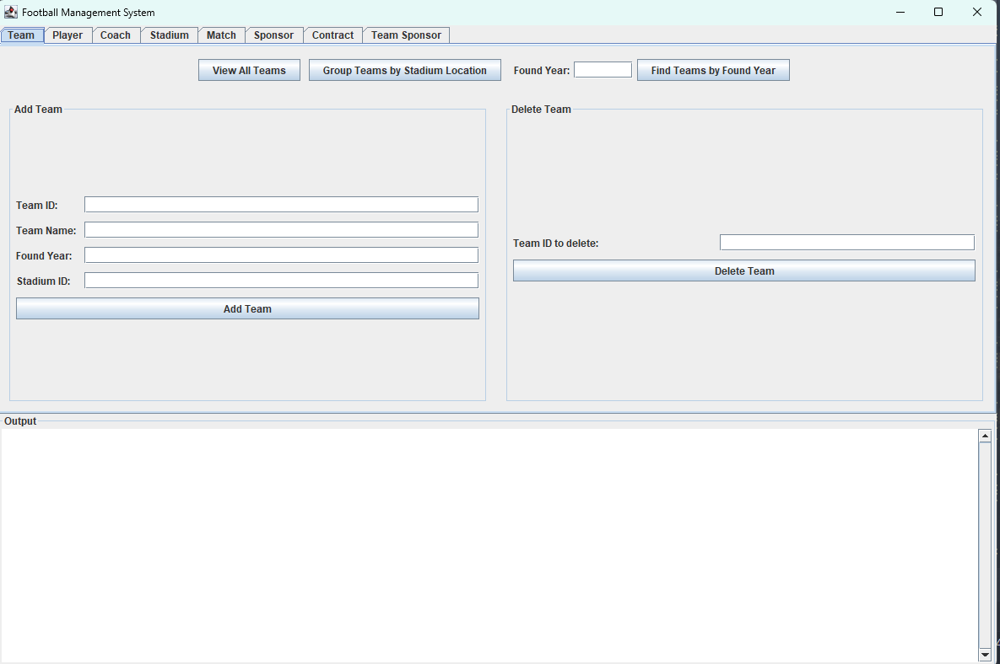
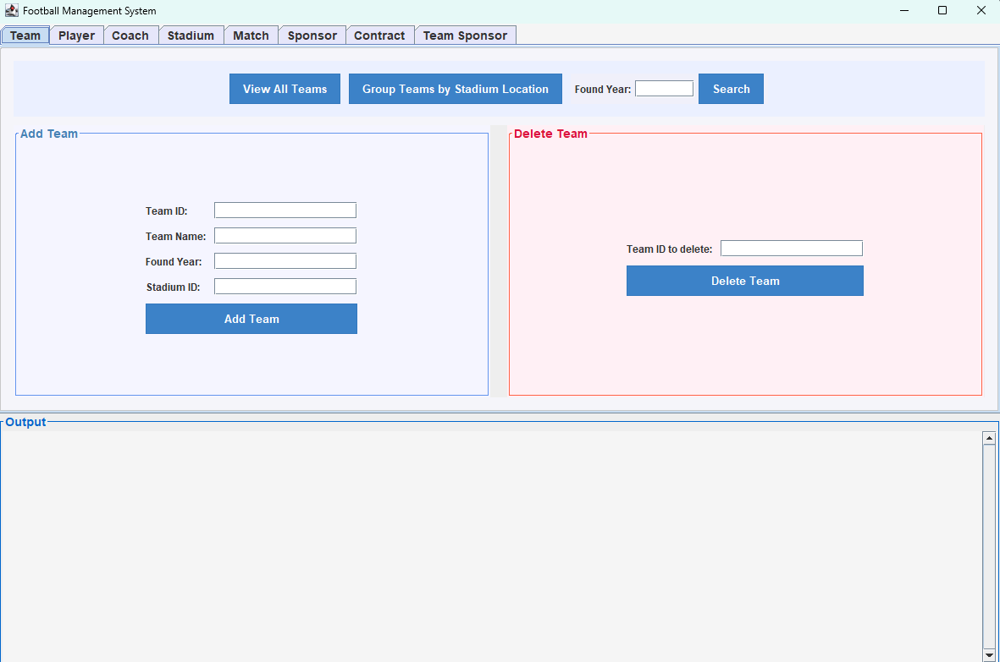

# Football Management System

A comprehensive database management system for football clubs, built with Java Swing and MySQL.

## Overview

The Football Management System is designed to manage various aspects of football operations, including teams, players, coaches, stadiums, matches, sponsors, and contracts. The system features a user-friendly graphical interface and robust database operations.

#### v1 version UI board

#### v2 version UI board

## Features

### Core Functionalities
- **Data Management**: Full CRUD operations (Create, Read, Update, Delete)
- **Query Operations**:
    - Basic queries
    - Nested queries
    - Aggregate queries
    - Group-by queries
- **Data Integrity**: Enforces referential integrity and data validation

### Entity Management
1. **Teams**
    - Team registration
    - Stadium assignment
    - Team statistics

2. **Players**
    - Player registration
    - Contract management
    - Team assignments

3. **Coaches**
    - Coach profiles
    - Team assignments
    - License management

4. **Stadiums**
    - Stadium information
    - Capacity management
    - Location tracking

5. **Matches**
    - Match scheduling
    - Result recording
    - Stadium assignment

6. **Sponsors**
    - Sponsor profiles
    - Sponsorship tracking
    - Contract management

7. **Contracts**
    - Player contracts
    - Sponsorship agreements
    - Contract status tracking

### Additional Features
- User-friendly GUI interface
- Transaction management
- Data validation and error handling
- Trigger functionality for data integrity

## Technical Details

### Database Design
- Implements at least 7 entities and 6 relationships
- Includes one-to-one, one-to-many, and many-to-many relationships
- Enforces primary key, foreign key, and null value constraints
- Includes indexed attributes for frequently queried fields

### User Interface
- Built with Java Swing
- Tabbed interface for different entities
- Integrated output display
- Input validation and error messaging

## Requirements

- Java JDK 8 or higher
- MySQL 5.7 or higher
- JDBC MySQL Connector

## Setup

1. Clone the repository
2. Import the SQL schema
3. Configure database connection settings
4. Run the main application class

## Usage

1. Launch the application
2. Use the tabbed interface to navigate between different entities
3. Perform operations using the provided buttons and forms
4. View results in the output area

## Contributing

Contributions are welcome. Please follow these steps:
1. Fork the repository
2. Create a feature branch
3. Commit your changes
4. Push to the branch
5. Create a Pull Request

